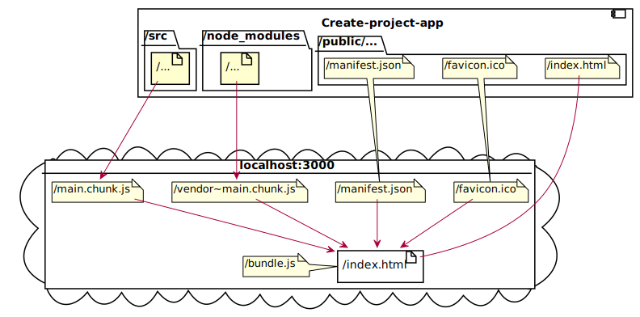

# l1_t1

## Header 2

### Header 3

#### Header 4

Simple text

- 1
- 2

* 3.2
  * 3.1
  * 3.2
    * 3.3
* 4

0. 1
1. 2
2. 3
   1. факт 1
   2. факт 2 
      1. подфакт 1
      2. подфакт 2

>Quote text
> ### Quote text
> 
> 1. факт 1
> 2. факт 2

`promp(prop)`

```
function Alarm(pros) {
    console.log(props)
}
```

**Bold text**

***Italic text***

~~Text~~



|Header 1 | Header 2|
|:-------- |:--------:|
| Val 1    | Val 2 | 
| val 3    | Val 4 |


